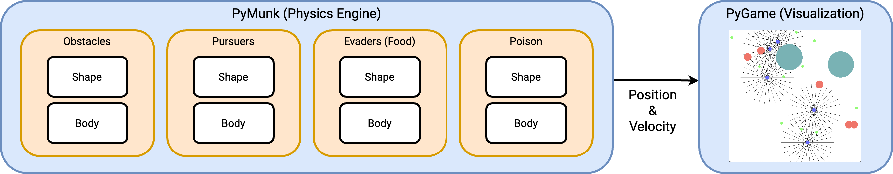
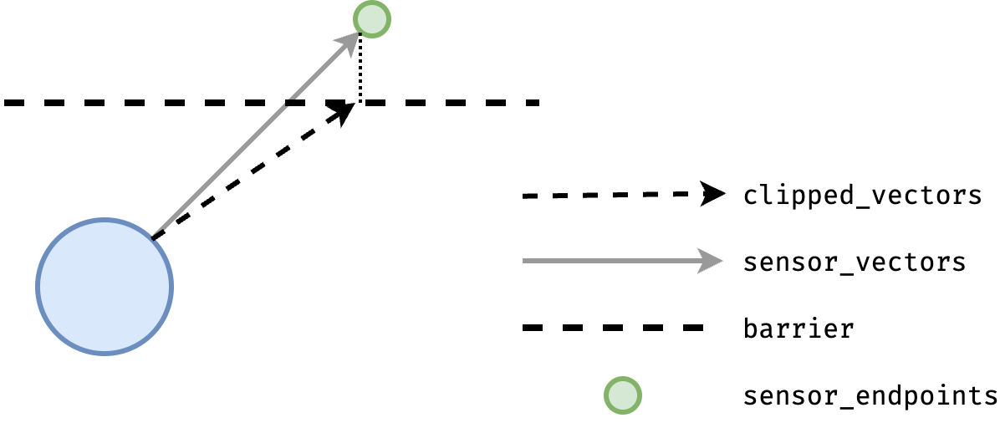
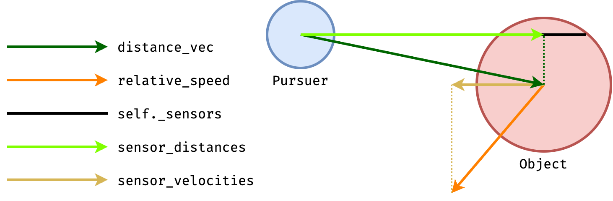

# WaterworldRevamp

This repo contains the original code for my version of the waterworld environment with a detailed guide of the code structure.

## Waterworld Components



## Barrier Sensor Mechanism



In the above image, the `clipped_vector` is only clipped along the `y` axis, thus the `clipped_endpoint` is at `(xSensorVector, yClippedVector)`, while the `sensor_endpoint` is at `(xSensorVector, ySensorVector)`. We can see that the intersection point with the barrier along the `sensor` is at

$$\Bigg[\Bigg(\frac{\texttt{yClippedVector}}{\texttt{ySensorVector}}\Bigg)\cdot\texttt{xSensorVector}, \Bigg(\frac{\texttt{yClippedVector}}{\texttt{ySensorVector}}\Bigg)\cdot\texttt{ySensorVector}\Bigg].$$

Since the sensor readings for the barrier distance is between $[0, \sqrt{2}]$, we can get the sensor readings as

$$\Bigg(\frac{\texttt{yClippedVector}}{\texttt{ySensorVector}}\Bigg)\cdot\sqrt{2}.$$

See `waterworld_base.Pursuers.get_sensor_barrier_readings` for the implementation details. One place that needs further explantation is 

```python
ratios = np.divide(
    clipped_vectors,
    sensor_vectors,
    out=np.ones_like(clipped_vectors),
    where=np.abs(sensor_vectors) > 1e-8,
)
```

The `out` argument initializes the output array with all ones, and the `where` argument acts like a mask. If `(np.abs(sensor_vectors) > 1e-8)[i, j] = True`, the output array at that position would contain the result of `clipped_vectors[i, j] / sensor_vectors[i, j]`. If `where[i, j] = False`, then the output at that position would contain `np.ones_like(clipped_vectors)[i, j]`. This is used to take care of situations when `x_sensor_vector = 0` or `y_sensor_vector = 0`.


## Object Sensor Mechanism



The `distance_vec` is computed as

$$\texttt{pursuerPosition} + \texttt{distanceVec} = \texttt{objectPosition}.$$

The `relative_speed` is computed as

$$\texttt{pursuerSpeed} + \texttt{relativeSpeed} = \texttt{objectSpeed}.$$

The projection of `distance_vec` along a `sensor_vector` can be computed as

$$\texttt{sensorDistance} = \texttt{distanceVec}^T\texttt{sensorVector}.$$

The projection of `relative_speed` along a `sensor_vector` can be computed as

$$\texttt{sensorVelocity} = \texttt{relativeSpeed}^T\texttt{sensorVector}.$$

Then, a mask is applied over all the sensed values to determine whether the object can be sensed by a sensor or not. The are three conditions for the object to satisfy to be sensed:

- all the sensors are unidirectional, thus, `distance_vec` must be positive to be sensed, i.e.,

$$\texttt{sensorDistance} > 0$$

- all the sensors have a fixed range, the object must be within the sensor range to be sensed, i.e.,

$$\texttt{sensorDistance} \leq \texttt{objectRadius} + \texttt{sensorRange}$$

- the sensor can only sense objects that intersect with the sensor antenae, thus, the length of the dashed green line must be less than the object radius, i.e.,

$$\texttt{distanceVec}^T\texttt{distanceVec} - \texttt{sensorDistance}^2 \leq \texttt{objectRadius}^2$$


